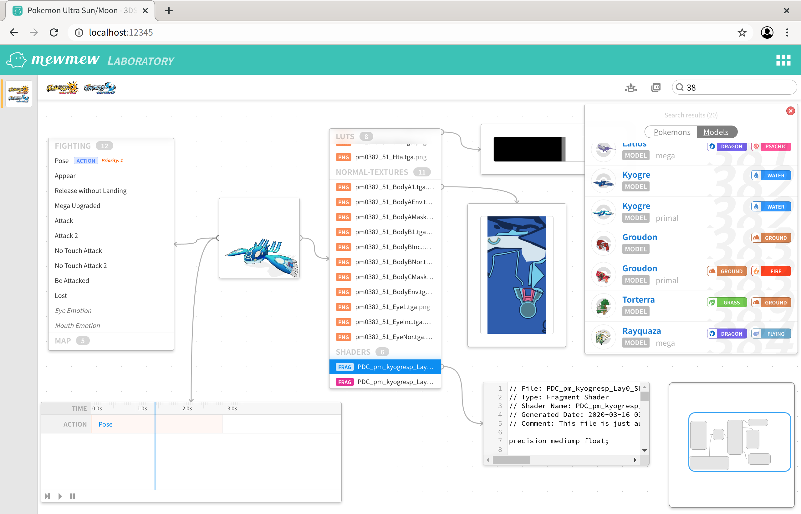
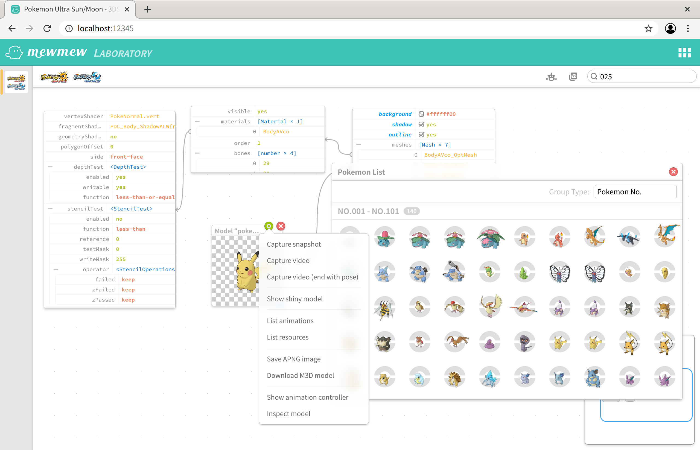

# Mod Tool for Pokemon Ultra Sun and Moon

This is a mod tool to extract Pokemon models from Pokemon Ultra Sun and Moon (3DS), it will autoscan the folders in the path specified, and generate indices on the fly.

You can search pokemons or models, and view the models, textures, geometries, skeletons, animations.

You can see the screenshots of it

# Screenshots




# Dependencies

* mew_js
* hako

# Supports

* Search all pokemon battle models in various methods
* Completely render the pokemon model just like it in game (including shiny models)
* Export pokemon model snapshot
* Export pokemon model animation video
* Export pokemon model pose animation as APNG animation image
* Download pokemon model as M3D file, which is a ZIP package with XML and JSON
* Export all pokemon model resources used
* Configurable rendering models (outlines, shadows, background color, and etc.)
* Animation controller to stick at any frame you like to export snapshots
* Inspect models details (mesh, material, and etc)

# Running

1. Install MSYS2 or similar POSIX simulation environment on Windows (Linux and macOS is not needed)
2. Download the mew_js runtime from [Mewchan Website](http://www.mewchan.com/dists.mhtml)
3. Update the PATH environment to include the Mewchan runtime `bin` folder
4. Create a new file `conf/hako.json`, specify the `a/0/9/4` folder:
    ```
    {
        "brainOptions": {
            "shrinkingCodes": false,
            "ui": "ui",
            "apps": {
                "pkmsm": "ui-pkmsm"
            },
            "pages": [ "index.html" ]
        },
        "playgrounds": {
            "http": { "port": 12345 }
        },
        "kitties": {
            "pkmsm": {
                "path": "/path/to/pkmsm-a.0.9.4"
            }
        },
        "resources": {
            "ui-pkmsm": {
                "playground": "http",
                "innerPath": "ui-pkmsm",
                "outerPath": "/~pkmsm"
            }
        }
    }
    ```
5. Run the `hako` command under the project folder
6. Open Chrome/Chromium and browse the url `http://localhost:12345`
