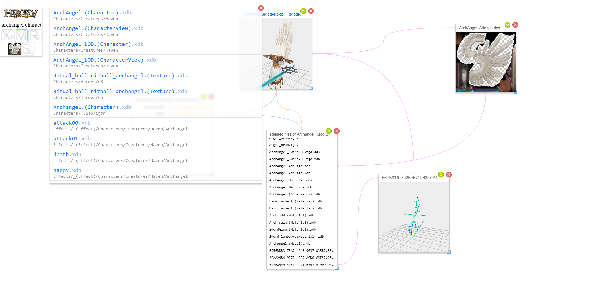

# Mod Tool for Heroes of Might and Magic 5

This is a mod tool for autoresolve the complex relationships in the PAK files of HMM5, it will autoscan the folders in the path specified, and generate indices on the fly.

You can search resources in multiple PAK files, and view the models, textures, geometries, skeletons, animations and varying xdb object instances.

You can see the screenshot of it

# Screenshots



# Dependencies

* mew_js
* hako

# Running

1. Install MSYS2 or similar POSIX simulation environment on Windows
2. Download the Windows runtime from [Mewchan Website](http://www.mewchan.com/dists.mhtml)
3. Update the PATH environment to include the Mewchan runtime `bin` folder
4. Create a new file `conf/hako.json`, specify the hmm5 install location:
    ```
{
    "playgrounds": {
        "http": { "port": 12345 }
    },
    "kitties": {
        "hmm5": { "paths": [ "absolute/path/to/hmm5" ] }
    }
}
    ```
5. Run the `hako` command under the project folder
6. Open Chrome/Chromium and browse the url `http://localhost:12345`
